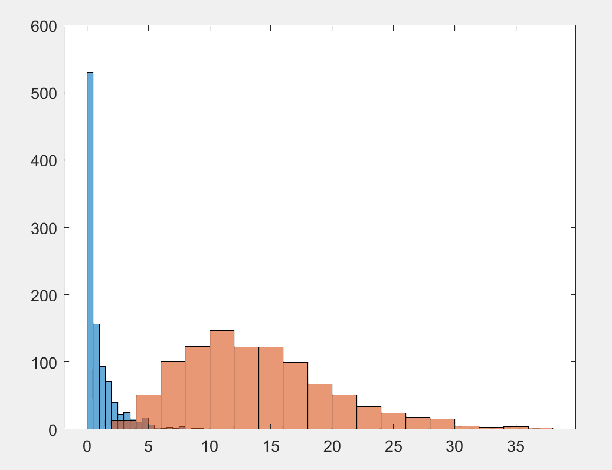
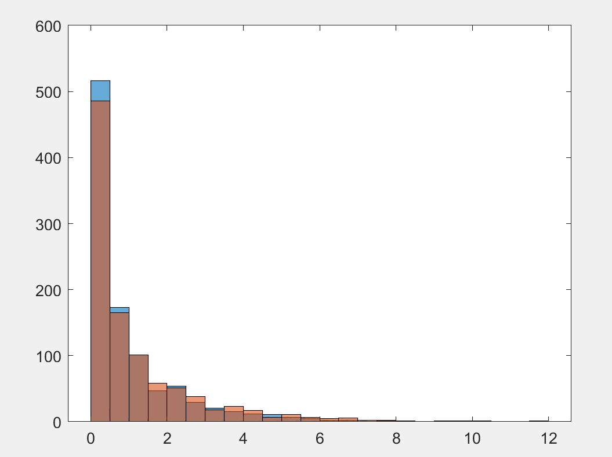

# Instrument Validity Test with Hansen’s J-statistic

논문 작성이 가능한가?: No
상태: 연구 중
태그: GMM, IV, misspecification
흥미로운가?: No

# Introduction

## Model

$Y_i=\beta_0+X_i\beta_1+e_i$ , where $E[e_i|Z_i]=0$ and $E[X_ie_i]\neq0$

$X_i=\pi_0+Z_i'\Pi+u_i$ , where $E[Z_iu_i]=0$ ,  $\underset{l \times 1}{Z_i}$ is a vector of IVs.

Recall that in a overidentified model, i.e., number of IVs is larger than number of endogenous variable, we can calculate 2SLS and Efficient GMM estimates:

### 2SLS estimator

$\hat{\beta}_{2sls}=(X'P_zX)^{-1}X'P_zY$ , where $P_z=Z(Z'Z)^{-1}Z'$

This is equivalent to GMM estimation using $E[Z_ie_i]=0$ as a moment condtion, with proper weight matrix. Note that $E[e_i|Z_i]=0 \Rightarrow E[Z_ie_i]=0$ .

### Efficient (2-step) GMM estimator

$\hat{\beta}_{egmm}=(X'PX)^{-1}X'PY$ , where $P=Z(n^{-1}Z'\hat\Omega(\hat{\beta}_{2sls}) Z)^{-1}Z'$ ,

and $\hat\Omega(\hat{\beta}_{2sls})=diag((Y_i-X_i\hat{\beta}_{2sls})^2)$

### Hansen’s J-statistic

To test IVs’ exogeneity conditions we use the following test statistic.

$J_n(\hat{\beta}_{egmm})=(\hat{e}'Z/n)(Z'\hat{\Omega}Z/n)(Z'\hat{e}/n)$

$=n^{-1}(Y-X\hat{\beta}_{egmm})'Z(n^{-1}Z'\hat\Omega(\hat{\beta}_{2sls}) Z)^{-1}n^{-1}Z'(Y-X\hat{\beta}_{egmm})$

$=n^{-2}(Y-X(X'PX)^{-1}X'PY)'P(Y-X(X'PX)^{-1}X'PY)$

$=n^{-2}(Y'PY-Y'PX(X'PX)^{-1}XPY)$

$=n^{-2}Y'P(Y-X(X'PX)^{-1}X)PY$

**Its asymptotic distribution is**

$n\times J_n \underset{d}{\rightarrow}\chi^2_{l-1}$

## Validity of a single Instrument

One deficit of the above test procedure is that one cannot say which of the IVs is invalid. Also if a researcher encounters a just-identified case, she cannot test IV exogeneity condition formally since in just-identified cases Hansen’s J-statistic is always equals zero, numerically.

To overcome these issues, we suggest to fully exploit the IV “exogeneity” condtion:

if $E[e_i|Z_i]=0$ , then $E[f(Z_i)e_i]=E[E[f(Z_i)e_i|Z_i]]=E[f(Z_i)E[e_i|Z_i]]=0$ .

We use $E[\underset{l \times 1}{f(Z_i)}e_i]=\underset{k \times 1}{0}$ as moment condition ($k=1$ for a single IV case).

### Model

$Y_i=\beta_0+X_i\beta_1+e_i$ , where $E[e_i|Z_i]=0$ and $E[X_ie_i]\neq0$

$X_i=\pi_0+h(Z_i)'\Pi+u_i$ , where $E[u_i|Z_i]=0$ ,  $\underset{m \times 1}{h(\cdot)}$ is an unknown function.

We choose $f(\cdot)$ such that $\underset{l_n \times 1}{f(\cdot)} \rightarrow h(\cdot)$ as $n \rightarrow \infty$. (how?)

**Claim**

$J_n(\hat{\beta}_{egmm})=(\hat{e}'f(Z)/n)(f(Z)'\hat{\Omega}f(Z)/n)(f(Z)'\hat{e}/n)$

$n\times J_n \underset{d}{\rightarrow}\chi^2_{m-k}$ (proof?)

# Simulation

### Data Generating Process

1. $Y_i=\beta_0+X_i'\beta_1+m(Z_i)'\alpha+e_i$
2. $X_i=\pi_0+Z_i\pi_1+Z_i^2\pi_2+\cdots+Z_i^m+u_i$

$E[f(Z_i)(Y_i-\beta_0-X_i\beta_1)]=E[f(Z_i)(m(Z_i)'\alpha+e_i)]$

$=E[f(Z_i)m(Z_i)']\alpha$

If $E[f(Z_i)m(Z_i)']\alpha \neq \bold{0_{m \times 1}}$ then the moment condition is misspecified.

### Sampling Steps

1. decide $\{\pi_i\}$ sequence, $m(\cdot), h(\cdot),\rho ,\alpha,\beta$
2. randomly draw $\begin{pmatrix}
u_i \\e_i
\end{pmatrix} \sim N(0,\begin{bmatrix}1&\rho \\ \rho &1 \end{bmatrix}) \ \ ,\ \ \forall i =1,2,\cdots n$
3. randomly draw $Z_i \sim N(0,1)$
4. compute $\{X_i\}$ by (1).
5. compute $\{Y_i\}$ by (2).
6. J-test with $\{Y_i,X_i,Z_i\}_{i=1}^n$

### Note

Because the IV is from standard normal m(Z) should contain even powers, for example m(Z)=Z^2

